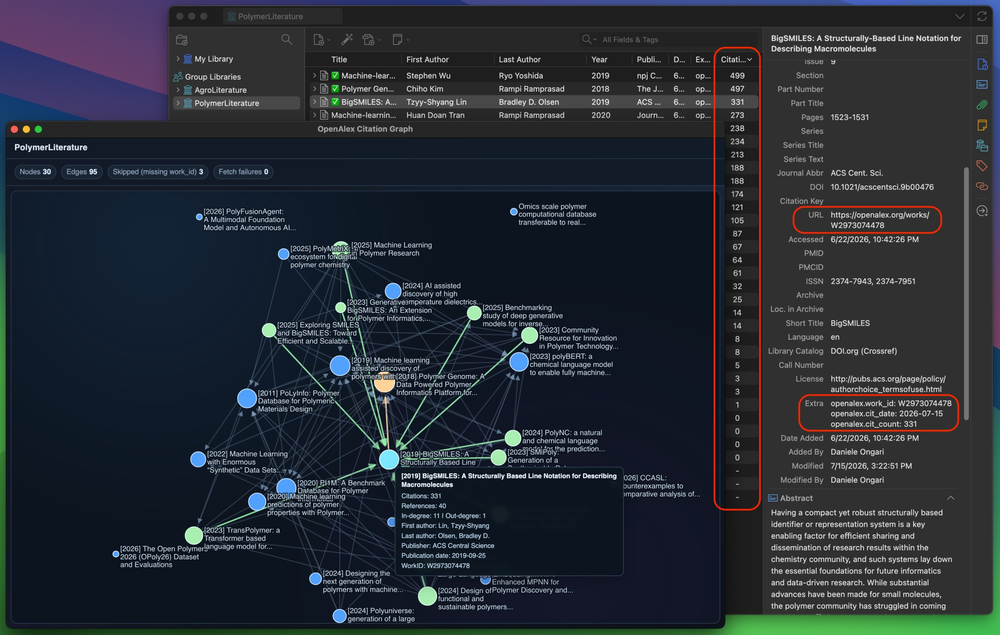

# Zotero OpenAlex

Zotero OpenAlex is a Zotero plugin that fetches OpenAlex metadata for your items and keeps citation data up to date.



The plugin stores machine-readable fields in each item's `Extra` field:

- `openalex.work_id: W...`
- `openalex.cit_count: N`
- `openalex.cit_date: YYYY-MM-DD`

Only `openalex.*` lines are parsed and managed by the plugin.

The complete OpenAlex Work response is also cached locally in
`zotero-openalex.sqlite` in the Zotero data directory. The cache is shared by items with the same
OpenAlex Work ID and is not synchronized through Zotero Sync.

> READ CAREFULLY: The plugin will OVERWRITE the existing URL metadata of your items with the OpenAlex Work URL.
> The rational is to use the DOI link as one-click link to the original source and URL as link to the OpenAlex Work page.

## What the plugin does

- Uses DOI-based lookup against the OpenAlex API to retrieve complete Work metadata.
- Stores as Extra `openalex.work_id`, `openalex.cit_count`, `openalex.cit_date`
- Stores the complete OpenAlex Work JSON in a local SQLite database.
- Updates citation counts when the `cit_date` is older that 3 months (or a span that the user can customize)
- Show the number of citations as the column "Citations"
- Right clicking on Libraries and Collections, the user can "Generate OpenAlex Graphs" showing which article is citing what, among the items in the Collection or its SubCollections. Graphs read references from SQLite and only request OpenAlex metadata that is missing from the cache.

## Installation

1. Download the latest `.xpi` from this repository's releases.
2. Open Zotero.
3. Install the `.xpi` as a plugin.
4. Restart Zotero if requested.

## Usage

### Usage: Manual update

1. Select one or more regular items in Zotero.
2. Open the item context menu.
3. Click `Get OpenAlex-WorkID`.

For a single item, Zotero shows a direct result message. For multiple items, Zotero shows an aggregate summary.

### Usage: Startup sync

When enabled, startup sync scans regular items and updates those that are missing metadata, have
stale citation dates, or do not yet have a complete SQLite cache record. The first startup after
installing this version can therefore take longer while existing `Extra` metadata is backfilled.

### Usage: Custom Settings

The main settings can be customized in the Zotero plugin settings panel (Windows: Edit > Settings):

- `apiKey` (default empty): optional OpenAlex API key.
- `autoUpdateOnStartup` (default `true`): check items for updates at startup.
- `staleMonths` (default `3`): months after which the number of citations is updated.
- `correctArxivArticles` (default `true`): when the DOI is missing and the URL specifies it is an arXiv article, change the `Item Type` to preprint and add the DOI accordingly.
- `showGraphTuningControls` (default `false`): show tunable graph settings directly in the Citation Graph window.

When `showGraphTuningControls` is enabled, the Citation Graph window shows a tuning panel with
all graph settings and a `Regenerate` button. Wheel and trackpad zoom are normalized for consistent,
responsive scrolling. Adjust `Wheel zoom sensitivity` in this panel to make zoom faster or slower;
the value is saved for future graph windows.

Graph layout treats every visible paper title and its node as one collision area. Titles that appear
after zooming or hovering briefly reheat the layout so they do not cover other visible titles or
nodes; hidden titles do not consume graph space. Citation edges can still pass behind title text.

These and other settings are also customizable via: Edit > Settings > Advanced > Config Editor > `extensions.zotero-openalex.*`

### Usage: Optional API key

The plugin works without an API key. You can optionally set one in Zotero settings to improve request allowance.

Get an OpenAlex API key at:

[https://openalex.org/settings/api-key](https://openalex.org/settings/api-key)

## Metadata behavior

- Existing `openalex.work_id`, `openalex.cit_count`, and `openalex.cit_date` lines are replaced when updated.
- New lines are inserted before `Citation Key:` when present, otherwise appended.
- Citation date is updated whenever a complete OpenAlex refresh is saved.
- URL, `Extra`, and SQLite writes use the same fetched Work and timestamp. If one datastore fails,
  the plugin attempts to restore the previous values.

## Privacy notes

- The API key is stored in local Zotero preferences.
- The plugin does not write your API key into item metadata.
- Requests are sent to the OpenAlex API endpoint (`https://api.openalex.org`).
- Complete Work responses are stored locally in `zotero-openalex.sqlite`. This file remains on the
  device and is not synchronized through Zotero Sync.

## Development (Developer)

This project uses TypeScript and `zotero-plugin-scaffold`.

### Requirements

- Node.js and npm
- Zotero installed locally

### Install dependencies

```sh
npm install
```

### Run in development mode

```sh
npm start
```

### Build

```sh
npm run build
```

### Lint and format checks

```sh
npm run lint:check
```

### Auto-fix lint/format

```sh
npm run lint:fix
```

### Tests

```sh
npm test
```

### Release

Releases are automated with Release Please and GitHub Actions. Do not edit the version, create a
release tag, build an XPI for publication, or edit `CHANGELOG.md` manually.

Every change must be squash-merged through a pull request whose title follows Conventional
Commits. The squash title becomes the commit on `main` and determines the next version:

| Pull request title                     | Version effect       | Example                        |
| -------------------------------------- | -------------------- | ------------------------------ |
| `fix: ...`                             | Patch/bugfix         | `9.2.0` to `9.2.1`             |
| `feat: ...`                            | Minor                | `9.2.0` to `9.3.0`             |
| `feat!: ...` or another type with `!`  | Major/breaking       | `9.2.0` to `10.0.0`            |
| `docs: ...`, `chore: ...`, `test: ...` | No release by itself | Included with the next release |

By project convention, the plugin's major version matches the latest Zotero major version against
which it has been tested. For example, plugin version `9.x` indicates testing against Zotero 9.
This convention is documented but not enforced by CI, so use a breaking-change (`!`) title only
when the corresponding major-version change is intentional.

After a release-worthy PR is merged, Release Please opens or updates one rolling release PR. That
PR contains the computed version and generated changelog. Review it like any other PR. Merging it
creates the `vX.Y.Z` tag and GitHub Release, then directly calls the artifact publishing workflow
to build and upload:

- `zotero-openalex.xpi`
- `update.json`

Zotero checks the stable
[`update.json`](https://github.com/danieleongari/zotero-openalex/releases/latest/download/update.json)
URL and downloads the versioned XPI referenced there. Generated release files are never committed
to the repository.

#### Release automation setup

Release Please uses the built-in, short-lived `GITHUB_TOKEN`; no custom release token or repository
secret is required. Under **Settings → Actions → General**, set workflow permissions to **Read and
write permissions** and enable **Allow GitHub Actions to create and approve pull requests**.

Release PRs created with `GITHUB_TOKEN` do not trigger separate pull-request workflows. CI still
runs on the merge to `main`, and the publishing workflow independently validates the release tag,
XPI, `update.json`, download URL, and checksum before uploading the assets.

If artifact publication fails after the tag and GitHub Release are created, fix the reported
problem and run the `Publish release artifacts` workflow manually with the existing `vX.Y.Z` tag.
Asset upload uses replacement semantics, so reruns are safe. A complete release must contain both
assets above; its XPI manifest version and `update.json` version must match the release tag.

## Project structure (Developer)

- `src/index.ts`: plugin global binding and entry wiring.
- `src/addon.ts`: addon state container.
- `src/hooks.ts`: lifecycle hooks (`onStartup`, window load/unload, shutdown).
- `src/modules/openalex.ts`: OpenAlex logic, metadata parsing/upsert, menu wiring, startup sync, citations column.
- `src/modules/openalexStore.ts`: versioned SQLite storage for complete OpenAlex Work responses.
- `addon/`: runtime assets (`manifest.json`, `bootstrap.js`, prefs/panes assets).
- `zotero-plugin.config.ts`: scaffold build and release configuration.

## Troubleshooting

- If API calls fail with `401/403`, verify the API key.
- If updates are skipped, verify the item has a DOI (field or `Extra`).
- If startup sync feels slow, increase `requestDelayMs` cautiously and adjust `staleMonths`.
- If the first sync after upgrading is slow, allow it to finish populating `zotero-openalex.sqlite`.
  Later citation graphs will reuse these cached Work records.

## Acknowledgements

- OpenAlex Work-ID retrieval inspired by [mtillman14/open-alex-work-id](https://github.com/mtillman14/open-alex-work-id)
- Citation Graph inspired by [Exyeus/zotero-citation-visualizer](https://github.com/Exyeus/zotero-citation-visualier)
- Citation column inspired by [daeh/zotero-citation-tally](https://github.com/daeh/zotero-citation-tally)

Thread opened on Zotero's forum at
[https://forums.zotero.org/discussion/132439/making-a-strong-zotero-openalex-connection](https://forums.zotero.org/discussion/132439/making-a-strong-zotero-openalex-connection),
to gather feedback and enthusiasts interested to collaborate.

Disclaimer: This is an unofficial plugin. The author is not affiliated with, endorsed by, or associated with Zotero or OpenAlex.
